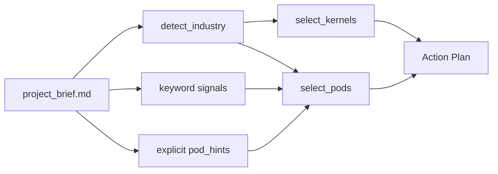

# Pod System: Industries, Kernels, and Pods

How Skill Autopilot selects the right capabilities for every project.

## Overview

When you start a project, the system reads your `project_brief.md` and makes three selection decisions:



1. **Industry detection** — classify the project into one of 41 industries.
2. **Kernel selection** — pick 1–2 B-kernels (domain-specific build & ship families) based on industry.
3. **Pod selection** — attach capability pods (functional teams) based on industry + keyword signals + explicit hints.

The result is a **compound selection**: a set of pods and kernels tailored to the project. This feeds into the decomposer, which generates a phased action plan with tasks assigned to specific agents within each pod.

## The Three Layers

### Layer 1: Industries (41 total)

Industries are the top-level classification. Each project brief is analyzed (via LLM or keyword scoring) and matched to one industry. The industry drives default kernel and pod selections.

| # | Industry | Default Kernels | Default Pods |
|---|---|---|---|
| 1 | Software / SaaS | digital_product | commercial |
| 2 | IT Services / Systems Integration | professional_services | commercial |
| 3 | Cloud / Data Centers | energy_asset_ops, digital_product | ops_supply |
| 4 | Cybersecurity (vendors) | digital_product, cyber_secops | legal_risk |
| 5 | Telecommunications | energy_asset_ops, digital_product | ops_supply |
| 6 | Semiconductors | industrial_manufacturing, safety_critical | ops_supply |
| 7 | Consumer Electronics | embedded_mechatronics, industrial_manufacturing | commercial, ops_supply |
| 8 | Automotive (OEM & mobility) | embedded_mechatronics, safety_critical | ops_supply |
| 9 | Rail / Transit | safety_critical, construction_infra | ops_supply, legal_risk |
| 10 | Aerospace | safety_critical, embedded_mechatronics | legal_risk, ops_supply |
| 11 | Space (launch/satellites) | safety_critical, embedded_mechatronics | legal_risk, ops_supply |
| 12 | Defense | safety_critical, cyber_secops | legal_risk, ops_supply |
| 13 | Maritime / Shipping | energy_asset_ops, construction_infra | ops_supply |
| 14 | Logistics / 3PL | construction_infra, data_analytics | ops_supply |
| 15 | Retail (physical) | data_analytics, digital_product | commercial, ops_supply |
| 16 | E-commerce / Marketplaces | digital_product, data_analytics | commercial, data_insight |
| 17 | Consumer Packaged Goods (CPG) | industrial_manufacturing, data_analytics | commercial, ops_supply |
| 18 | Food & Beverage Manufacturing | industrial_manufacturing, chem_materials | ops_supply |
| 19 | Agriculture | industrial_manufacturing, data_analytics | ops_supply |
| 20 | Mining & Metals | energy_asset_ops, industrial_manufacturing | ops_supply |
| 21 | Oil & Gas (upstream) | energy_asset_ops | ops_supply, legal_risk |
| 22 | Oil & Gas (midstream) | energy_asset_ops | ops_supply |
| 23 | Refining / Petrochemicals | chem_materials, industrial_manufacturing | ops_supply, legal_risk |
| 24 | Chemicals (specialty/commodity) | chem_materials | legal_risk, ops_supply |
| 25 | Materials (advanced materials) | chem_materials | ops_supply |
| 26 | Construction (GC / EPC) | construction_infra | ops_supply, finance_governance |
| 27 | Real Estate (dev/property mgmt) | construction_infra, energy_asset_ops | finance_governance |
| 28 | Utilities (electric/gas/water) | energy_asset_ops | ops_supply |
| 29 | Power generation (incl. nuclear) | energy_asset_ops, safety_critical | legal_risk, ops_supply |
| 30 | Renewables (wind/solar/storage) | energy_asset_ops, embedded_mechatronics | ops_supply |
| 31 | Healthcare Providers (hospitals/clinics) | life_sciences, data_analytics | data_insight |
| 32 | Health Insurance / Payers | financial_products, data_analytics | legal_risk, finance_governance |
| 33 | Medical Devices | safety_critical, life_sciences | legal_risk |
| 34 | Pharmaceuticals | life_sciences | legal_risk, finance_governance |
| 35 | Biotech | life_sciences | legal_risk |
| 36 | CRO / Clinical Trials Services | life_sciences, professional_services | legal_risk |
| 37 | Banking (retail/commercial) | financial_products | legal_risk, finance_governance |
| 38 | Payments / Fintech | financial_products, digital_product | legal_risk, finance_governance |
| 39 | Insurance | financial_products, data_analytics | legal_risk, finance_governance |
| 40 | Capital Markets / Asset Mgmt | financial_products, ml_ai_systems | finance_governance, data_insight |
| 41 | Political Consulting / Public Affairs | professional_services, content_production | commercial, legal_risk, data_insight |

### Layer 2: B-Kernels (14 total)

B-kernels are domain-specific build & ship families. Each kernel represents a delivery discipline with its own standards, evidence requirements, and verification approach. Kernels generate tasks in the Build and Verify phases.

| Kernel ID | Name | Domain |
|---|---|---|
| `digital_product` | B-Digital Product | Apps, SaaS, platforms — iterative software delivery |
| `data_analytics` | B-Data & Analytics | Pipelines, BI, metrics systems, data platforms |
| `ml_ai_systems` | B-ML/AI Systems | Model lifecycle, evaluation, monitoring, ML ops |
| `cyber_secops` | B-Cyber & SecOps | Detections, incident response, hardening |
| `embedded_mechatronics` | B-Embedded & Mechatronics | Firmware, sensors, controls, embedded systems |
| `safety_critical` | B-Safety-Critical Engineering | Formal V&V, safety cases, certification |
| `industrial_manufacturing` | B-Industrial Manufacturing | Process engineering, industrialization |
| `chem_materials` | B-Chem/Materials Process | Formulations, scale-up, QA evidence |
| `life_sciences` | B-Life Sciences R&D to Regulated | Evidence chains, GLxP, regulated R&D |
| `energy_asset_ops` | B-Energy & Asset Ops | Asset operations, reliability, field work |
| `financial_products` | B-Financial Products & Controls | Auditability, risk models, reporting |
| `construction_infra` | B-Construction & Infrastructure | Permits, schedule/cost, site safety |
| `content_production` | B-Content Production | Media, publishing, brand assets |
| `professional_services` | B-Professional Services Delivery | SoW, client governance, delivery ops |

Each kernel has a corresponding `SKILL.md` in `skill_autopilot/skills/kernel/<kernel_id>/`.

### Layer 3: Attachable Pods (7 total)

Pods are functional capability teams. Each pod bundles a set of agents that can be assigned tasks during plan generation. The Core pod is always active; the others are attached based on project needs.

| Pod ID | Name | Agents | Attachment Logic |
|---|---|---|---|
| `core` | Core | orchestrator, scribe, research, quality, delivery_tracker | **Always on** |
| `discovery` | Discovery & Definition | requirements_specifier, competitor_analyst, user_researcher, feasibility_assessor | **Always on** |
| `commercial` | Commercial | pricing_analyst, gtm_strategist, sales_enabler | Industry or keywords |
| `finance_governance` | Finance & Governance | budget_planner, cost_controller, audit_steward | Industry or keywords |
| `legal_risk` | Legal / Risk / Compliance | contract_reviewer, compliance_officer, risk_assessor | Industry or keywords |
| `people_talent` | People & Talent | team_planner, hiring_advisor, skill_gap_analyst | Keywords or hints only |
| `ops_supply` | Ops & Supply | procurement_agent, vendor_manager, logistics_planner | Industry or keywords |
| `data_insight` | Data & Insight | data_architect, bi_analyst, metrics_designer | Industry or keywords |

## How Selection Works

### Step 1: Industry Detection

The brief text is classified into one of the 41 industries. Two methods:

1. **LLM classification** (preferred) — if `ANTHROPIC_API_KEY` is set, a fast Claude Haiku call classifies the industry from the brief text.
2. **Weighted keyword scoring** (fallback) — each industry has weighted keyword signals. The industry with the highest cumulative score above a 0.5 threshold wins.

### Step 2: Kernel Selection (`select_kernels`)

1. **Industry mapping** — the detected industry is looked up in `INDUSTRY_KERNEL_MAP`. This provides 1–2 default kernels.
2. **Text signal fallback** — if no industry match, kernel tags are searched in the brief text.
3. **Ultimate fallback** — if nothing matches, `digital_product` is selected.

### Step 3: Pod Selection (`select_pods`)

Pods are selected from three sources, in order:

1. **Always-on**: `core` and `discovery` are always included.
2. **Explicit hints**: if the brief contains pod-hint markers (e.g., mentioning "legal", "compliance"), those pods are attached.
3. **Keyword matching**: the brief text is scanned for keyword signals per pod (e.g., "budget" → `finance_governance`, "compliance" → `legal_risk`).
4. **Industry mapping**: the detected industry is looked up in `INDUSTRY_POD_MAP`. Industry-appropriate pods are attached automatically, even if the brief text doesn't contain the right keywords.

### Step 4: Plan Generation

The decomposer takes the selected pods and kernels and generates a 4-phase action plan:

1. **Discovery** — Core scoping + research + kernel-specific assessments.
2. **Build** — Execution plan + kernel deliverables + skill tasks + documentation.
3. **Verify** — Quality checks + kernel-specific validation.
4. **Ship** — Finalize deliverables + produce closure documentation.

Each task is assigned to a specific agent within a pod and includes instructions, acceptance criteria, inputs, and outputs.

## How to Add a New Industry

Adding a new industry requires changes to three data structures in `skill_autopilot/pods.py`:

### 1. Add to `INDUSTRY_KERNEL_MAP`

Map your industry to 1–2 B-kernels that best describe its delivery discipline:

```python
INDUSTRY_KERNEL_MAP: Dict[str, List[str]] = {
    # ... existing entries ...
    "Your Industry Name": ["kernel_id_1", "kernel_id_2"],
}
```

Choose from the 14 existing kernel IDs: `digital_product`, `data_analytics`, `ml_ai_systems`, `cyber_secops`, `embedded_mechatronics`, `safety_critical`, `industrial_manufacturing`, `chem_materials`, `life_sciences`, `energy_asset_ops`, `financial_products`, `construction_infra`, `content_production`, `professional_services`.

### 2. Add to `INDUSTRY_POD_MAP`

Map your industry to the pods that should auto-attach:

```python
INDUSTRY_POD_MAP: Dict[str, List[str]] = {
    # ... existing entries ...
    "Your Industry Name": ["pod_id_1", "pod_id_2"],
}
```

Choose from: `commercial`, `finance_governance`, `legal_risk`, `people_talent`, `ops_supply`, `data_insight`. (`core` and `discovery` are always included automatically.)

### 3. Add to `_INDUSTRY_SIGNALS_WEIGHTED`

Add keyword detection signals so the system can identify your industry from brief text:

```python
_INDUSTRY_SIGNALS_WEIGHTED: list[tuple[str, list[tuple[str, float]]]] = [
    # ... existing entries ...
    ("Your Industry Name", [
        ("specific_keyword", 1.0),     # highly specific → weight 1.0
        ("moderately_specific", 0.7),  # moderate signal → 0.6–0.8
        ("generic_term", 0.3),         # generic → low weight to avoid false matches
    ]),
]
```

**Weight guidelines:**
- **1.0** — uniquely identifies this industry (e.g., "lobbying" for Political Consulting)
- **0.7–0.9** — strong signal but could appear in other contexts
- **0.3–0.5** — supporting signal, shouldn't win on its own
- **0.1–0.2** — very generic, only contributes in combination

### 4. Run tests

```bash
.venv311/bin/pytest skill_autopilot/tests/test_pod_compounding.py -v
```

The `test_all_40_industries_have_pod_mappings` test automatically validates that every entry in `INDUSTRY_KERNEL_MAP` has a corresponding entry in `INDUSTRY_POD_MAP`.

### 5. (Optional) Update LLM classifier

If using LLM-based industry detection, the classifier automatically uses `INDUSTRY_KERNEL_MAP.keys()` as its industry list — no separate update needed.
